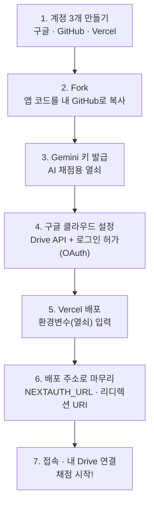

# 설치 가이드 — 컴퓨터를 잘 몰라도, 처음부터 끝까지

> **코딩을 전혀 몰라도 됩니다.** 이 문서의 순서대로 **클릭만** 하면, 내 전용 채점 앱이 인터넷 주소로 만들어집니다.
> - 처음 하는 분은 넉넉히 **40~60분** 잡으세요. (계정 3개를 새로 만들면 더 걸립니다.)
> - 중간에 막히면 맨 아래 **[9. 자주 막히는 곳](#9-자주-막히는-곳-문제-해결)** 을 먼저 보세요. 거의 모든 문제가 여기 있습니다.
> - **모든 서비스는 무료**입니다. (개인 사용량 기준)

---

## 전체 흐름 한눈에



글로 보면 이런 순서입니다:

1. **계정 3개**(구글·GitHub·Vercel)를 만든다 → 2. 앱 코드를 **내 GitHub로 복사(Fork)** → 3. **Gemini(AI) 키**를 받는다 → 4. **구글 클라우드**에서 드라이브 연결을 허가받는다 → 5. **Vercel**에 올리고 열쇠(환경변수)를 넣는다 → 6. 만들어진 **주소를 다시 넣어 마무리**한다 → 7. **접속해서 내 드라이브를 연결**하고 채점을 시작한다.

> 💡 **왜 이렇게 단계가 많나요?** 앱이 *내 구글 드라이브에 학생 답안을 저장*하고 *AI로 채점*하기 때문입니다. 그래서 "AI 열쇠(3단계)"와 "내 드라이브를 만질 권한(4단계)" 두 가지를 앱에 쥐여 줘야 합니다. 한 번만 설정해 두면 다음부터는 그냥 쓰면 됩니다.

---

## 0. 시작 전에 — 이 앱은 무엇이고, 무엇이 필요한가

학생들의 손글씨 서논술형 답안을 **사진/PDF로 올리면**, AI(Gemini)가 글자를 읽고(OCR) 채점 초안을 만들어 주고, 교사가 확인·수정해 **내 구글 드라이브에 저장**하는 웹앱입니다. **학생은 로그인하지 않습니다. 교사만 사용합니다.**

### 준비물 (모두 무료)
- [ ] **구글 계정**(지메일) — AI 키 발급 + 학생 답안을 저장할 드라이브
- [ ] **GitHub 계정** — 앱 코드를 내 것으로 복사(Fork)
- [ ] **Vercel 계정** — 앱을 진짜 인터넷 주소로 띄워줌 (GitHub 계정으로 가입)
- [ ] 컴퓨터(크롬 권장)와 약 40~60분

### 한 줄 용어 사전
| 용어 | 쉽게 말하면 |
|------|------------|
| **GitHub** | 앱의 설계도(코드)를 보관하는 창고 |
| **Fork** | 그 창고를 **내 계정으로 통째로 복사**하는 것 |
| **Vercel** | 복사한 코드를 **진짜 웹사이트 주소로 띄워주는** 서비스 |
| **Gemini** | 글자를 읽고 채점하는 **구글 AI 엔진** |
| **OAuth(오어스)** | "이 앱이 내 구글 드라이브를 써도 좋다"는 **구글의 허가증** |
| **환경변수** | 앱에 넣어주는 **비밀 열쇠·설정값**(키, 주소, 비번 등) |
| **배포(Deploy)** | 코드를 실제로 **인터넷에 올려 작동시키는 것** |

### ★ 먼저 "값 모으기 메모장"을 켜두세요
설치하는 동안 여러 곳에서 **열쇠(키)** 가 생깁니다. 그때그때 메모장(또는 한글 문서)에 붙여두면 5단계에서 편합니다. 아래를 복사해 빈칸을 채워 가세요.

```text
[ 내 값 모으기 ]   ※ 절대 남에게 보여주지 마세요(특히 KEY/SECRET)
GEMINI_API_KEY       = AIza...........................        (3단계에서)
GOOGLE_CLIENT_ID     = ...............apps.googleusercontent.com  (4단계에서)
GOOGLE_CLIENT_SECRET = GOCSPX-........................        (4단계에서)
NEXTAUTH_SECRET      = (40자 이상 아무 무작위 문자열)            (5단계에서)
APP_ACCESS_PASSWORD  = (내가 정하는 접속 비밀번호)               (직접 정함)
GEMINI_MODEL         = gemini-3.5-flash                       (그대로)
내 Vercel 앱 주소      = https://..............vercel.app        (5단계 후 확정)
NEXTAUTH_URL         = (= 위의 '내 Vercel 앱 주소'와 똑같이)
내 리디렉션 URI        = 위 주소 + /api/auth/callback/google
```

---

## 1. 계정 3개 만들기 (이미 있으면 건너뛰기)

### 1-A. 구글 계정 (대부분 이미 있음)
지메일을 쓰고 있다면 그게 구글 계정입니다. **그대로 사용**하세요.
- 없다면: [accounts.google.com/signup](https://accounts.google.com/signup) 에서 가입.
- 💡 학교 계정(@ㅇㅇ.go.kr 등)은 기관이 외부 앱 권한을 막아 두는 경우가 있어, **개인 지메일**을 권장합니다.

### 1-B. GitHub 계정
1. [github.com/signup](https://github.com/signup) 접속.
2. **이메일 → 비밀번호 → 사용자 이름(username)** 을 차례로 입력. (username은 영문/숫자, 나중에 주소에 쓰입니다.)
3. 간단한 사람 확인(퍼즐)을 통과하고 **Create account**.
4. 가입한 이메일로 온 **숫자 코드**를 입력해 인증하면 끝. (요금제는 **Free** 그대로)

### 1-C. Vercel 계정
1. [vercel.com](https://vercel.com/) 접속 → **Sign Up**.
2. **Continue with GitHub**(GitHub로 계속)를 선택 → 방금 만든 GitHub로 로그인.
3. **Authorize Vercel**(권한 허용)을 누르면 연결 완료. (Hobby/Free 플랜 선택)
   - 이렇게 하면 Vercel이 내 GitHub 저장소를 볼 수 있어, 배포가 쉬워집니다.

> ✅ 여기까지 하면 계정 준비 끝. 이제 본격 설치 시작.

---

## 2. 앱을 내 GitHub로 복사(Fork)하기

1. 강사가 알려준 원본 저장소 주소(예: `https://github.com/Byeongeo/drive-essay-scoring`)에 접속합니다.
2. (로그인 안 돼 있으면) GitHub에 **로그인**합니다.
3. 오른쪽 위 **`Fork`** 버튼 → **`Create fork`** 클릭.
4. 잠시 뒤 **내 계정 아래에 같은 저장소**가 생깁니다. 주소가 `github.com/내아이디/drive-essay-scoring` 로 바뀝니다.

> ### ⚠️ 가장 중요 — 저장소는 반드시 **Public(공개)** 으로 두세요
> Fork한 저장소가 **Private(비공개)** 이면 **Vercel 배포가 "Blocked"(차단)** 되어 앱이 안 올라갑니다. (연수에서 가장 자주 겪는 문제!)
> - 이 앱 코드에는 **비밀번호·키가 들어있지 않습니다.** 비밀은 전부 5단계의 "환경변수"로 따로 넣으므로 **공개해도 안전**합니다.
> - 혹시 Private이 됐다면: 내 저장소 → **Settings → 맨 아래 Danger Zone → Change repository visibility → Public**.

---

## 3. Gemini API 키 발급받기 (AI 채점용 열쇠)

1. **[Google AI Studio](https://aistudio.google.com/app/apikey)** 에 **구글 계정으로** 접속합니다.
2. (처음이면 약관 동의) **`Create API key`(API 키 만들기)** 클릭. 프로젝트를 고르라고 하면 아무거나(또는 자동 생성)로 진행.
3. 만들어진 키(`AIza...` 로 시작하는 긴 문자열)를 **복사** → **값 모으기 메모장의 `GEMINI_API_KEY`** 칸에 붙여넣기.

> 🔒 이 키가 있으면 남이 **내 비용으로** AI를 쓸 수 있습니다. 채팅·메일·깃허브 등 어디에도 올리지 마세요.

---

## 4. 구글 클라우드 콘솔 설정 (가장 까다로운 부분 — 천천히 따라오세요)

앱이 **내 구글 드라이브에 폴더·파일을 만들려면** 구글의 허가(OAuth)가 필요합니다. 네 개의 작은 단계로 나눠 진행합니다.

> 📌 구글 콘솔 화면은 시기에 따라 **두 가지 모습** 중 하나로 보입니다. 이 가이드는 **항목 이름**으로 안내하니, 메뉴 글자만 찾으면 어떤 화면이든 따라올 수 있습니다.

### 4-A. 프로젝트 만들기
1. **[Google Cloud Console](https://console.cloud.google.com/)** 접속(구글 로그인). 약관이 뜨면 동의.
2. 화면 **맨 위 가운데의 프로젝트 선택 칸**(▾) 클릭 → **`새 프로젝트(New Project)`**.
3. 이름은 아무거나(예: `essay-scoring`) → **만들기(Create)**.
4. 만든 뒤 다시 위쪽 프로젝트 칸에서 **그 프로젝트가 선택돼 있는지** 확인합니다. (이후 모든 작업이 이 프로젝트 안에서 이뤄집니다.)

### 4-B. Google Drive API 사용 설정
1. 왼쪽 메뉴(☰) → **`API 및 서비스(APIs & Services)` → `라이브러리(Library)`**.
2. 검색창에 **`Google Drive API`** 입력 → 결과 클릭 → **`사용(Enable)`**.
   - "이미 사용 설정됨"이면 그대로 두면 됩니다.

### 4-C. 로그인 동의 화면 구성 (OAuth 동의 화면 / "Google 인증 플랫폼")
1. 왼쪽 메뉴 → **`API 및 서비스` → `OAuth 동의 화면(OAuth consent screen)`**.
   - 새 화면에서는 **"Google 인증 플랫폼(Google Auth Platform)"** 시작 페이지가 나오고 **`시작하기(Get started)`** 버튼이 보일 수 있습니다. 누르고 진행하세요.
2. 입력 항목(이름만 다를 뿐 묻는 건 같습니다):
   - **앱 이름(App name)**: 아무거나(예: `서논술 채점`)
   - **사용자 지원 이메일(User support email)**: 내 지메일
   - **대상(Audience) / User Type**: **외부(External)** 선택
   - **개발자 연락처(Developer contact)**: 내 지메일
   - 동의 후 **만들기/저장**.
3. **테스트 사용자 추가** — *연수처럼 잠깐 쓸 때 필요*
   - **`대상(Audience)`** 탭(옛 화면은 동의 화면 단계 중 **`테스트 사용자(Test users)`**)으로 가서 **`+ 사용자 추가`** → **내 지메일 주소**를 넣습니다.
   - ⚠️ 이걸 빠뜨리면 로그인할 때 **"액세스 차단됨"** 에러가 납니다.
4. **사용 범위(스코프) 추가** — 보일 때만
   - **`데이터 액세스(Data Access)`** 탭에 **`범위 추가(Add or remove scopes)`** 가 있으면, 검색창에 **`drive.file`** 을 넣어 나오는 항목(**"앱으로 만든 특정 파일만" 접근**)을 체크해 추가·저장합니다.
   - 이 화면이 안 보여도 괜찮습니다. 앱이 로그인 때 알아서 요청합니다.

> ### 🟢 (권장) 학기 내내 쓸 거면 "앱 게시(Production)"로 바꾸세요
> - **테스트(Testing)** 상태로 두면, 로그인 권한이 **7일마다 만료**되어 **약 일주일 뒤 드라이브 연결이 풀립니다.**(연수 당일은 괜찮지만 실사용엔 불편)
> - **`대상(Audience)`** 탭에서 **`앱 게시(Publish app)`** → 확인을 누르면 **Production(프로덕션)** 상태가 되어 이 만료가 사라집니다.
> - 이 앱은 **`drive.file`(앱이 만든 파일만)** 범위만 쓰므로, 게시해도 구글의 **별도 심사가 필요 없습니다.** (혹시 "확인되지 않은 앱" 화면이 떠도, 내 앱이니 [9번](#9-자주-막히는-곳-문제-해결)의 방법대로 통과하면 됩니다.)

### 4-D. OAuth 클라이언트(웹) 만들기 → ID·비밀번호 받기
1. 왼쪽 메뉴 → **`API 및 서비스` → `사용자 인증 정보(Credentials)`** (또는 인증 플랫폼의 **`클라이언트(Clients)`** 탭).
2. **`+ 사용자 인증 정보 만들기` → `OAuth 클라이언트 ID`** (새 화면은 **`클라이언트 만들기`**).
3. **애플리케이션 유형: `웹 애플리케이션(Web application)`** 선택, 이름은 아무거나.
4. **승인된 리디렉션 URI(Authorized redirect URIs)** 에 아래를 추가합니다:
   ```text
   http://localhost:3000/api/auth/callback/google
   ```
   - 배포 주소(`https://....vercel.app/...`)는 **아직 정해지지 않았습니다.** 5단계에서 주소가 나오면 **여기로 다시 와서 한 줄 더 추가**합니다. (지금은 localhost 한 개만 넣어도 됩니다.)
   - 💡 **팁:** 5단계에서 프로젝트 이름을 미리 정하면 주소를 예측할 수 있어, 지금 바로 `https://<정한이름>.vercel.app/api/auth/callback/google` 도 같이 넣어둘 수 있습니다.
5. **만들기**를 누르면 **클라이언트 ID** 와 **클라이언트 보안 비밀번호(Secret)** 가 나옵니다.
   - 둘 다 복사해 **값 모으기 메모장**의 `GOOGLE_CLIENT_ID`, `GOOGLE_CLIENT_SECRET` 칸에 붙여넣기.
   - (`ID`는 `...apps.googleusercontent.com`, `Secret`은 `GOCSPX-...` 모양입니다.)

---

## 5. Vercel에 올리기 (배포) + 환경변수 입력

1. **[Vercel](https://vercel.com/)** 로그인 → **`Add New…` → `Project`**.
2. 목록에서 2단계에서 Fork한 **`drive-essay-scoring`** 을 찾아 **`Import`**.
   - 안 보이면 **`Adjust GitHub App Permissions`** 로 내 저장소 접근을 허용하세요.
3. **프로젝트 이름(Project Name)** 을 확인합니다. 이 이름이 곧 **내 앱 주소**가 됩니다 → `https://<이 이름>.vercel.app`. 원하면 여기서 바꿀 수 있습니다(영문·숫자·하이픈).
4. Framework는 자동으로 **Next.js** 로 잡힙니다. **그대로** 둡니다.
5. **`Environment Variables`(환경변수)** 를 펼쳐 아래 6개를 **하나씩** 입력합니다(이름/값 칸에 각각):

| 이름(Key) | 값(Value) | 출처 |
|-----------|-----------|------|
| `GEMINI_API_KEY` | `AIza...` | 3단계 |
| `GEMINI_MODEL` | `gemini-3.5-flash` | 그대로 입력 |
| `GOOGLE_CLIENT_ID` | `...apps.googleusercontent.com` | 4단계 |
| `GOOGLE_CLIENT_SECRET` | `GOCSPX-...` | 4단계 |
| `NEXTAUTH_SECRET` | 아무 긴 무작위 문자열 | 아래 설명 |
| `APP_ACCESS_PASSWORD` | 내가 정하는 접속 비밀번호 | 직접 정함 |

   - **`NEXTAUTH_SECRET` 만드는 법:** 길고 무작위면 됩니다. [generate-secret.vercel.app/32](https://generate-secret.vercel.app/32) 에서 나오는 값을 복사하거나, 키보드를 마구 눌러 40자 이상 만드세요.
   - **`APP_ACCESS_PASSWORD`:** 앱에 들어갈 때 묻는 **접속 비밀번호**입니다. 외울 수 있는 값으로 정하세요. (주소가 남에게 알려져도 이 비번을 모르면 못 들어옵니다.)
   - **`NEXTAUTH_URL` 은 아직 넣지 않아도 됩니다.** 주소가 확정되는 6단계에서 넣습니다.
6. **`Deploy`** 클릭 → **1~3분** 기다립니다. "Congratulations" 화면이 나오면 성공.

---

## 6. 배포 주소로 마무리 설정 (가장 실수 많은 단계 — 정확히!)

이제 **실제 주소**가 생겼습니다. 그 주소를 **세 곳에 똑같이** 맞춰야 로그인이 됩니다.

1. **내 앱 주소 확인:** Vercel 프로젝트 → **`Domains`**(또는 Deploy 완료 화면)에서 주소를 복사합니다. 예: `https://drive-essay-scoring-abc123.vercel.app` (끝에 `/` 없이)
   - 값 모으기 메모장의 **`내 Vercel 앱 주소`** 에 붙여넣기.
2. **`NEXTAUTH_URL` 추가:** Vercel → **`Settings` → `Environment Variables`** → 새 변수 추가
   ```text
   이름:  NEXTAUTH_URL
   값:    https://drive-essay-scoring-abc123.vercel.app
   ```
   (← **내 앱 주소와 글자 하나까지 똑같이**. 끝에 `/` 붙이지 말 것)
3. **구글 리디렉션 URI 추가:** 4-D의 OAuth 클라이언트 화면으로 돌아가 **승인된 리디렉션 URI** 에 아래를 **추가**합니다.
   ```text
   https://drive-essay-scoring-abc123.vercel.app/api/auth/callback/google
   ```
   (= 내 앱 주소 + `/api/auth/callback/google`. **오타·끝 슬래시 주의**) → 저장.
4. **다시 배포(Redeploy):** 환경변수를 바꿨으니 적용하려면 재배포가 필요합니다.
   Vercel → **`Deployments`** → 맨 위 배포의 **`…` → `Redeploy`** → 확인.

> 🎯 핵심: **내 앱 주소 = `NEXTAUTH_URL` = 리디렉션 URI 앞부분**, 이 셋이 **완전히 동일**해야 합니다. 다르면 로그인 시 `redirect_uri_mismatch` 가 납니다.

---

## 7. 처음 사용해보기

1. **내 앱 주소**에 접속 → **접속 비밀번호**(`APP_ACCESS_PASSWORD`)를 입력.
   - **공용/학교 PC면 "이 컴퓨터 기억하기"를 체크하지 마세요.** (창을 닫으면 다시 비번을 물어 남이 못 보게 합니다.) 개인 PC면 체크 시 **30일** 동안 안 물어봅니다.
2. **`설정 점검`(/setup)** 에 들어가 모든 항목이 **`설정됨`**(초록)인지 확인. 빨간 `필요`가 있으면 5~6단계의 그 변수를 다시 확인하세요.
3. **`Google Drive 연결`** → 본인 구글 계정 로그인 → 권한 허용.
   - "확인되지 않은 앱" 화면이 뜨면 → **고급(Advanced) → '(앱이름)'(으)로 이동** 을 눌러 진행(내 앱이라 안전).
4. **실제 채점 흐름:**
   - **과목/회차 만들기** → **문제·채점기준표 첨부**(파일 선택 또는 **캡처를 Ctrl+V로 붙여넣기**) → **루브릭/예시답안**(선택) →
   - **반별 PDF 업로드**(학년·반 입력 → 학생 PDF 올리기 → 자동 분류 확인 → Drive 저장. *"저장하면서 OCR 함께 실행"* 을 켜면 채점화면에서 OCR이 이미 끝나 있습니다) →
   - **채점**(원본과 OCR을 비교, 불명확 표시 `****`와 틀린 곳만 클릭해 고치고 → AI 채점 → 점수·근거·피드백을 교사가 수정 → 최종 저장) →
   - **리포트**(반·회차별 집계 + CSV 내려받기).

---

## 8. 마지막 점검 체크리스트

- [ ] Fork한 내 GitHub 저장소가 **Public**
- [ ] Vercel 배포가 **Ready**(초록)
- [ ] `/setup` 화면에서 6개 변수 모두 **설정됨**
- [ ] `NEXTAUTH_URL` = 내 앱 주소(끝 슬래시 없음)와 **정확히 일치**
- [ ] 구글 **리디렉션 URI** 에 `내앱주소/api/auth/callback/google` **포함**
- [ ] 구글 동의 화면 **테스트 사용자**에 내 이메일(또는 **앱 게시=Production**)
- [ ] **Google Drive 연결** 성공 → 과목 만들기까지 됨

---

## 9. 자주 막히는 곳 (문제 해결)

| 증상 | 원인 / 해결 |
|------|------------|
| 배포가 **"Blocked"(차단)** | 저장소가 **Private**. 2단계 ⚠️대로 **Public** 으로 바꾸고 **Redeploy**. |
| 구글 로그인 시 **"액세스 차단됨 / Access blocked"** | 4-C의 **테스트 사용자에 내 이메일**을 안 넣었습니다. 추가하거나, **앱 게시(Production)** 로 전환. |
| 로그인 후 **`redirect_uri_mismatch`** | 6단계의 셋(내 앱 주소·`NEXTAUTH_URL`·리디렉션 URI)이 **글자까지 동일**해야 함. 오타·끝 `/`·`http/https` 확인 후 **Redeploy**. |
| **"이 앱은 Google에서 확인하지 않았습니다"** 경고 | 내 앱이라 안전합니다. **고급(Advanced) → '(앱이름)'(으)로 이동(unsafe)** → 계속. 경고가 거슬리면 4-C에서 **앱 게시**. |
| **며칠(약 7일) 뒤 드라이브 연결이 자꾸 풀림** | 동의 화면이 **테스트(Testing)** 상태라 권한이 7일마다 만료됩니다. 4-C의 **`앱 게시(Publish app)`** 로 **Production** 전환하면 해결. |
| `/setup` 에서 어떤 변수가 **`필요`(빨강)** | 그 이름의 환경변수가 비었거나 오타. Vercel **Settings → Environment Variables** 에서 고치고 **Redeploy**. |
| **AI 채점/OCR 실패** | `GEMINI_API_KEY` 가 맞는지, `GEMINI_MODEL` 이 `gemini-3.5-flash` 인지 확인. AI Studio에서 키가 살아있는지도 확인. |
| 변경했는데 **화면이 그대로** | ① Vercel **Deployments** 가 **Ready** 인지 ② 브라우저 **Ctrl+Shift+R**(강력 새로고침) 또는 시크릿 창. |
| 학생이 많을 때 **업로드/채점이 느림** | 정상입니다. PDF 변환·AI 호출을 **학생별로 순차** 처리합니다. 창을 닫지 말고 기다리세요. |

---

### 연수 운영(강사용) 한 줄 요약
강사가 원본 저장소 + 데모 앱을 준비 → 연수생이 **계정 3개 → Fork → Vercel Import → 환경변수 → 배포 → 주소로 마무리 → 자기 Drive 연결**. 각자 자기 앱·자기 드라이브라 데이터가 **완전히 분리**됩니다.
더 자세한 운영 순서는 [TRAINING_GUIDE.md](TRAINING_GUIDE.md), 이어 작업·인수인계는 [HANDOFF.md](HANDOFF.md) 를 참고하세요.
