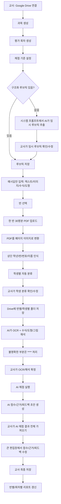

# Drive 기반 서논술형 채점 앱 명세

## 목표

초보 교사가 Firebase 설정 없이 자기 GitHub 저장소와 Vercel 배포만으로 개인용 서논술형 채점 앱을 갖게 한다.

데이터는 교사 개인 Google Drive에 저장한다.

## 연수 운영 방식

1. 강사는 원본 GitHub 저장소와 강사용 Vercel 데모 앱을 준비한다.
2. 연수 초반에는 강사 데모 앱으로 실제 결과를 보여준다.
3. 연수 후반에는 연수자가 원본 저장소를 Fork한다.
4. 연수자는 Vercel에 자기 저장소를 Import한다.
5. 연수자는 환경변수를 넣고 배포한다.
6. 연수자는 자기 Google Drive를 연결해 개인 앱으로 사용한다.

## 핵심 워크플로우



## 채점 방식

토큰 비용과 정확도 균형을 위해 채점 방식을 교사가 선택한다.

1. 텍스트 기반 채점
   - OCR/해석 확정본과 시각 요소 설명만 보낸다.
   - 비용이 낮고 빠르다.
   - 국어, 영어, 사회 등 텍스트 중심 답안에 적합하다.

2. 이미지 포함 채점
   - OCR/해석 확정본과 원본 답안 이미지를 함께 보낸다.
   - 비용이 높지만 수식, 도형, 그래프, 그림, 화학식 판단에 유리하다.
   - 수학, 과학 답안에 권장한다.

3. 자동 판단
   - AI 해석 결과에 수식, 도형, 그래프, 그림, 표, 화학식이 있으면 이미지 포함 채점을 추천한다.
   - 없으면 텍스트 기반 채점을 추천한다.

앱의 기본값은 텍스트 기반 채점이다.

## Drive 데이터 모델

### app-index.json

```json
{
  "version": 1,
  "rootFolderId": "drive-file-id",
  "subjects": [
    {
      "id": "subject-id",
      "name": "과학",
      "folderId": "drive-file-id"
    }
  ]
}
```

### assessment.json

```json
{
  "id": "assessment-id",
  "title": "서논술형 평가 1회",
  "date": 1781372400000,
  "subjectId": "subject-id",
  "systemPrompt": "",
  "rubricSource": "structured",
  "gradingModel": "gemini-3.5-flash"
}
```

### class-index.json

```json
{
  "grade": 1,
  "classNo": 1,
  "originalUploadFileId": "drive-file-id",
  "students": [
    {
      "id": "student-id",
      "grade": 1,
      "classNo": 1,
      "studentNo": 5,
      "name": "홍길동",
      "folderId": "drive-file-id",
      "status": "final-saved",
      "totalScore": 9
    }
  ]
}
```

## 채점 결과 저장

AI 결과와 교사 확정 결과를 분리한다.

```json
{
  "aiGrading": {
    "scores": [],
    "totalScore": 8,
    "reasons": [],
    "feedback": "AI 피드백"
  },
  "finalGrading": {
    "scores": [],
    "totalScore": 9,
    "reasons": [],
    "feedback": "교사가 수정한 최종 피드백",
    "confirmedByTeacher": true
  }
}
```

## UI 원칙

- 채점 화면의 점수, 근거, 피드백 편집창은 기본적으로 크게 보여준다.
- AI 피드백만 가져오는 것이 아니라 AI 점수, 영역별 근거, 총점, 피드백 전체를 가져온다.
- 교사가 수정한 최종 결과를 저장해야 리포트에 반영한다.
- AI 채점 결과는 항상 교사 최종 확인 전 상태로 표시한다.
- 반별 PDF 저장은 요청 크기 제한을 피하기 위해 학생별 순차 저장으로 처리한다.
